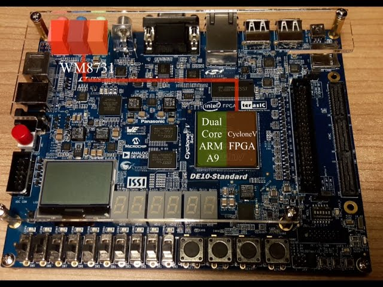

# 🎮 Reflex Master

   <!-- You can adjust the width as needed -->

Welcome to the GitHub repository for the Reflex Master game, a culminating project for the ECE-3375 Microprocessors course. Designed and developed by a team of enthusiastic engineering students, Reflex Master is a modern take on the classic reflex games, encouraging players to improve their cognitive skills and reaction times through fun and engaging gameplay.

## 🌟 Project Overview

Reflex Master challenges players with a series of rapid-fire commands, such as "Bop it", "Pull it", and "Twist it", which they must execute before time runs out. This game not only offers entertainment but also serves as a tool for cognitive enhancement, suitable for individuals of all ages. By blending physical interaction with digital feedback, Reflex Master stands out as an innovative approach to traditional reflex games.

## 📚 Further Reading

Dive deeper into the engineering processes, design decisions, and technical challenges overcome during the development of Reflex Master. Our comprehensive project report provides detailed insights into the project's inception, execution, and impact.

[Read the Full Project Report](https://docs.google.com/document/d/1zhJ2A0OmSHnoQ3SLMxo00A_iqbROQcLfDXBl4ErOLsc/edit?usp=sharing)

## 👥 The Team

Reflex Master is the result of the collaborative effort of four dedicated students. Each member brought their unique skills and perspectives to the project, contributing to its success:

- **Paul Gherghel** - Specialist in audio processing and game feedback mechanisms. [Github](https://github.com/ClutchForce)
- **Tyler Maddox** - Expert in game logic and timing functions. [Github](https://github.com/tmaddox23)
- **Abdul Saleh** - Focused on input recognition and user interaction. [Github](https://github.com/abdulrhamansaleh)
- **Cole McCutcheon** - Handled the game's visual output and sequence generation. [Github](https://github.com/ColeMcClutch)

---

*ECE-3375 Project: Engaging the mind, one reflex at a time.*

